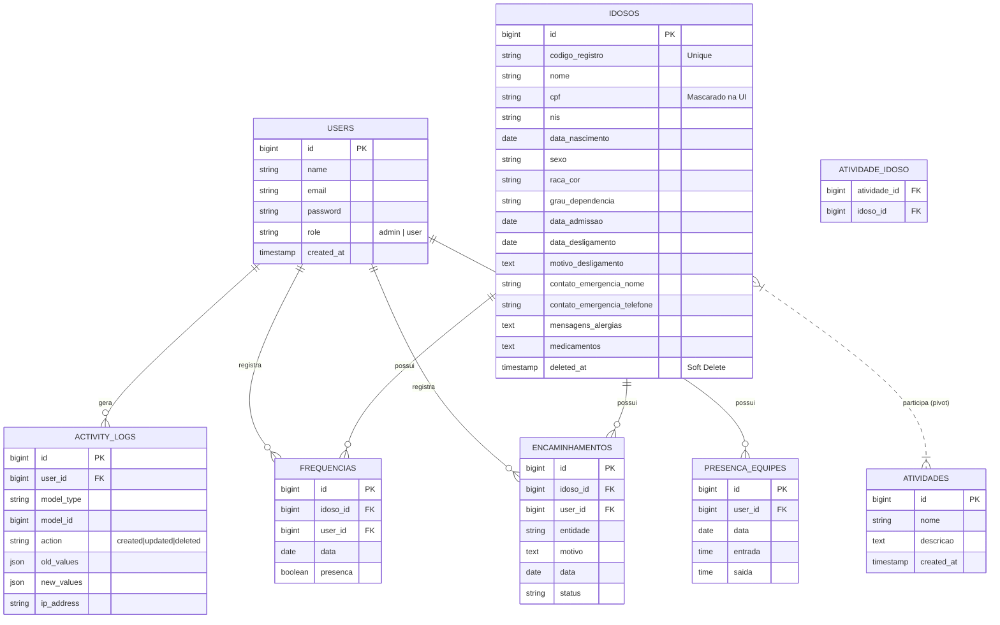

# Arquitetura e Engenharia Reversa - Gestão CDI

Este documento serve como um guia técnico para entender a estrutura do projeto e como recriá-lo do zero, seguindo uma metodologia de engenharia de software sênior.

## 1. Diagrama de Entidade-Relacionamento (ERD)

O diagrama abaixo, em formato Mermaid, descreve a estrutura do banco de dados e os relacionamentos entre as entidades.

## 2. Metodologia de Reconstrução (Passo a Passo)

Para replicar este projeto sem auxílio de IA, siga esta ordem lógica:

### Fase 1: Fundação e Autenticação
1.  **Instalação do Laravel:** `composer create-project laravel/laravel .`
2.  **Starter Kit:** Instalar o **Laravel Breeze** para garantir uma base de autenticação sólida e segura.
3.  **Configuração do Ambiente:** Ajustar o `.env` para o banco de dados e as permissões de acesso.

### Fase 2: Modelagem de Dados (Migrations)
1.  Criar as migrations seguindo a ordem de dependência (ex: criar `users` antes de `idosos`, e `idosos` antes de `frequencias`).
2.  Garantir o uso de `foreignId` para chaves estrangeiras com `constrained()` para manter a integridade referencial.
3.  Implementar `softDeletes()` em tabelas críticas como `idosos`.

### Fase 3: Lógica de Domínio (Models)
1.  Definir os relacionamentos (`hasMany`, `belongsTo`, `belongsToMany`) nos Models.
2.  Implementar **Accessors** para máscaras (CPF/NIS) e cálculos (Idade/Faixa Etária).
3.  Criar a **Trait `Loggable`** para auditoria automática.
4.  Usar o método `booted()` no Model `Idoso` para a geração automática do código de registro (`CDI-YYYY-NNNN`).

### Fase 4: Controladores e Validação
1.  Criar **FormRequests** para separar a lógica de validação da lógica de negócio nos Controllers.
2.  Implementar os métodos CRUD nos Controllers.
3.  Criar as rotas protegidas por middleware `auth` e, para áreas administrativas, o gate `admin-access`.

### Fase 5: Interface e Relatórios
1.  Utilizar **Blade Components** para reutilização de UI.
2.  Integrar **Tailwind CSS** para o design.
3.  Configurar o **DomPDF** para geração de relatórios técnicos em PDF.

---

## 3. Nota de Infraestrutura

Além das tabelas de negócio detalhadas acima, o banco de dados contém tabelas nativas do framework Laravel, essenciais para o suporte operacional do sistema:

- **Autenticação e Sessões:** `sessions`, `password_reset_tokens`.
- **Performance e Cache:** `cache`, `cache_locks`.
- **Processamento em Segundo Plano:** `jobs`, `job_batches`, `failed_jobs`.

Estas tabelas seguem o padrão de segurança e escalabilidade do Laravel e não foram incluídas no diagrama ERD para manter o foco na lógica de negócio do Centro de Dia para Idosos.

---
*Este documento foi gerado para auxiliar na manutenção e evolução do sistema Gestão CDI.*
